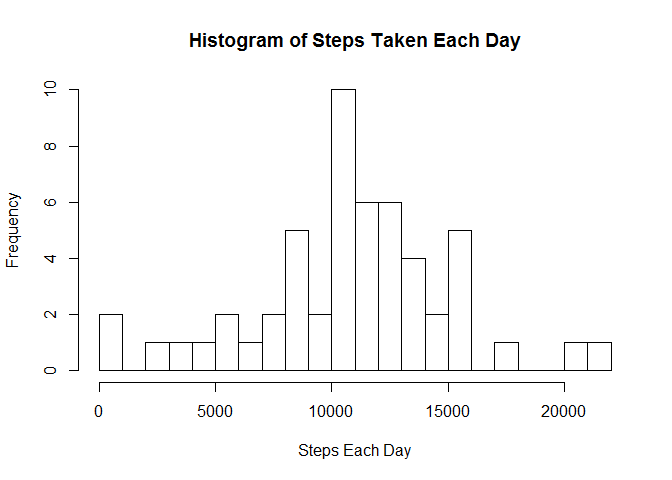
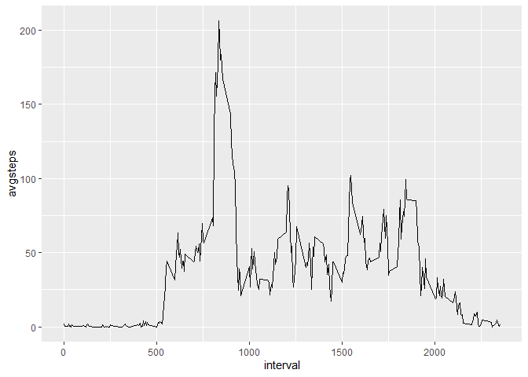
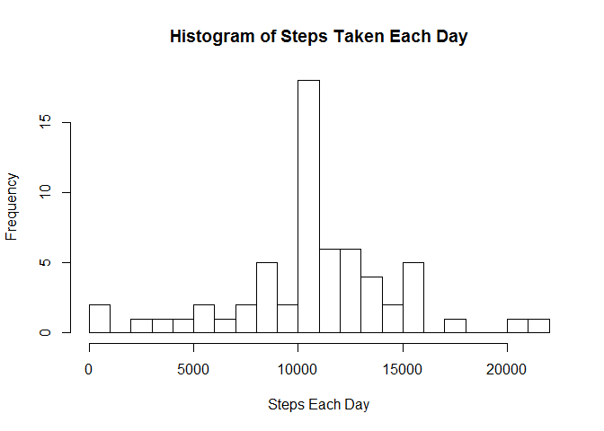
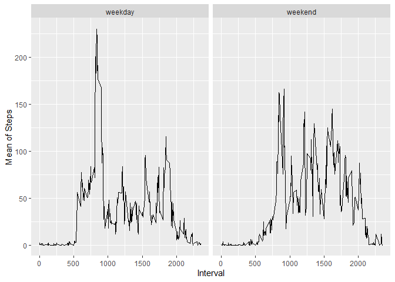

Reproducible Research: Week 2 Project
================

# Read in the data and clean

``` r
file <- "activity.csv"
activityraw <- read.csv(file)
activityraw$date<- as.Date(activityraw$date)
```

## What is the mean total number of steps taken per day?

Calculate the total number of steps taken per day

Plot on a histogram

``` r
library(dplyr)
```

    ## Warning: package 'dplyr' was built under R version 3.5.3

    ## 
    ## Attaching package: 'dplyr'

    ## The following objects are masked from 'package:stats':
    ## 
    ##     filter, lag

    ## The following objects are masked from 'package:base':
    ## 
    ##     intersect, setdiff, setequal, union

``` r
stepsbydate <- activityraw %>% 
  group_by(date) %>%
  summarize(datesteps = sum(steps)) %>%
  na.omit()
hist(stepsbydate$datesteps, xlab = "Steps Each Day", main = "Histogram of Steps Taken Each Day", breaks = 20)
```

<!-- -->

The mean and median of the total number of steps taken per day:

``` r
mean(stepsbydate$datesteps)
```

    ## [1] 10766.19

``` r
median(stepsbydate$datesteps)
```

    ## [1] 10765

## What is the average daily activity pattern?

``` r
activitypattern <- activityraw %>%
  na.omit() %>%
  group_by(interval) %>%
  summarize(avgsteps = mean(steps))
library(ggplot2)
```

    ## Warning: package 'ggplot2' was built under R version 3.5.3

``` r
ggplot(activitypattern, aes(x = interval, y = avgsteps)) +
  geom_line()
```

<!-- -->

## Which 5-minute interval contains the maximum number of steps?

``` r
activitypattern[which(activitypattern$avgsteps == max(activitypattern$avgsteps)),]
```

    ## # A tibble: 1 x 2
    ##   interval avgsteps
    ##      <int>    <dbl>
    ## 1      835     206.

## Imputing missing values

How many observations in the dataset have missing values?

``` r
sum(is.na(activityraw))
```

    ## [1] 2304

Fill in missing values.

*I have chosen to use the mean for that five minute interval*

``` r
replacewithmean <- function(x) replace(x, is.na(x), mean(x, na.rm=TRUE))
intervalmean <- activityraw %>%
  group_by(interval) %>%
  mutate(steps = replacewithmean(steps))
```

## Make a histogram of the new data.

``` r
intervalstepsbydate <- intervalmean %>% 
  group_by(date) %>%
  summarize(datesteps = sum(steps))
hist(intervalstepsbydate$datesteps, xlab = "Steps Each Day", main = "Histogram of Steps Taken Each Day", breaks = 20)
```

<!-- -->

Calculate the mean and median total number of steps taken per
day

``` r
mean(intervalstepsbydate$datesteps)
```

    ## [1] 10766.19

``` r
median(intervalstepsbydate$datesteps)
```

    ## [1] 10766.19

## Are there differences in activity patterns between weekdays and weekends?

Create a factor variable for “weekday” and “weekend”

*I chose to use the dataset with imputed step counts*

``` r
weekdays <- intervalmean
weekdays$date <- weekdays(weekdays$date)
weekdays$date <- ifelse(weekdays$date == "Saturday" | weekdays$date == "Sunday", "weekend","weekday")
stepsbyday <- weekdays %>%
  group_by(date, interval) %>%
  summarize(meansteps = mean(steps))
ggplot(stepsbyday, aes(x = interval, y = meansteps)) +
  geom_line() +
  xlab("Interval") +
  ylab("Mean of Steps") +
  facet_grid(~date)
```

<!-- -->
